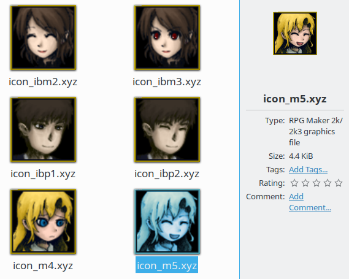
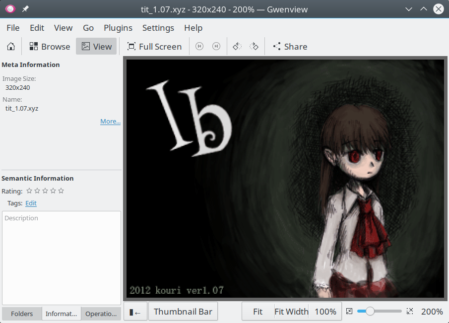

# kde-xyz-thumbnailer

Generates thumbnails from RPG Maker 2000/2003 XYZ graphics format for view in
the KDE file manager Dolphin and provides a QImageIOPlugin for loading XYZ
images in Qt5 applications.

## Screenshots

## Prequisites

 * `zlib` from zlib.org
 * `KDE Framework 5 (KF5)` from KDE5

## Installation

    $ cmake . -DCMAKE_INSTALL_PREFIX=/usr -DCMAKE_BUILD_TYPE=Release
    $ make
    $ sudo make install

## Usage

### Thumbnailer

Open the Dolphin settings, navigate to General -> Previews and enable "RPG
Maker 2k/2k3 XYZ Images". The file manager should create thumbnails now.

### QImageIOPlugin

Open any XYZ file with a Qt5 application of your choice that uses QImageIO
(e.g. gwenview).
