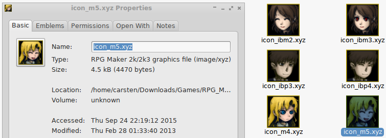

# xyz-thumbnailer

Generates thumbnails from RPG Maker 2000/2003 XYZ graphics format for view in
your Linux file manager (Nautilus/Nemo/Caja/...)

## Screenshot

## Prequisites

 * `xyz2png` (also in the EasyRPG Tools repository/source distribution)
 * `convert` from ImageMagick suite
 * `shared-mime-info` from freedesktop.org (to add the XYZ image mime type)

## Installation

    $ make [PREFIX=/usr] install

Packagers may want to use the `$DESTDIR` variable and need to call
`update-mime-database` after installation.

## Usage

	$ xyz-thumbnailer path/to/input.xyz path/to/output.png [size in pixels]

GNOME/GTK3 integration will be installed by default, so file managers should
start creating thumbnails after restarting them.
However, you may need to enable thumbnail generation itself first. Check your
file manager settings and manual for additional information.
