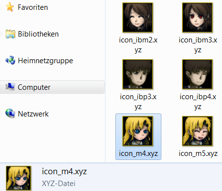

# xyz-thumbnailer

Generates thumbnails from RPG Maker 2000/2003 XYZ graphics format for view in
the Windows Explorer.

Windows XP is not supported, consider disconnecting such PCs from the
internet.

## Screenshot

## Installation

Run `install.cmd` in the `bin` directory.

Important: Don't delete the bin folder, this will break the shell handler!

## Uninstallation

Run `uninstall.cmd` in the `bin` directory.

## Usage

Enter any directory containing xyz files and choose an explorer view with
huge symbols.
